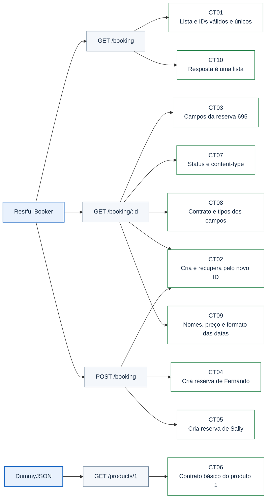

# playwright-api-tests

[](https://github.com/fernandoho93/playwright-api-tests/actions/workflows/playwright.yml)

Projeto de estudo em JavaScript para praticar requisições HTTP e validações de respostas com Playwright. Os testes verificam status, content-type e dados retornados pelas APIs.

## Visão geral

- **Stack:** JavaScript, Playwright Test e npm.
- **Cobertura:** 10 cenários de consulta e criação de reservas e consulta de produto.
- **Documentação:** cenários BDD em português e fluxograma interativo.
- **Evidências:** relatório HTML e anexos JSON por teste.
- **CI:** execução no GitHub Actions a cada push ou pull request para `main` ou `master`.

## Instalação

Tenha Node.js e npm instalados. O projeto foi validado com Node.js 24.
Na pasta do projeto, instale as dependências:

```bash
git clone https://github.com/fernandoho93/playwright-api-tests.git
cd playwright-api-tests
npm ci
```

## Execução

```bash
# Executar todos os testes
npm test

# Listar os testes sem executar
npm run test:list

# Abrir o relatório HTML da última execução
npm run report
```

A configuração atual repete os cenários nos projetos chromium, firefox e webkit. Para executar cada cenário apenas uma vez:

```bash
npm test -- --project=chromium --workers=1
```

Os testes usam a fixture `request` para enviar requisições HTTP, sem abrir páginas no navegador.

## APIs e cobertura atual

| API | O que é testado |
| --- | --- |
| [Restful Booker](https://restful-booker.herokuapp.com) | Listagem, consulta por ID e criação de reservas; validações de campos, tipos e dados enviados. |
| [DummyJSON](https://dummyjson.com) | Consulta do produto 1 e validação dos principais campos e tipos. |

Os arquivos ficam em `tests/`. A configuração fica em `playwright.config.js` e o workflow do GitHub Actions em `.github/workflows/playwright.yml`.

As APIs são públicas e precisam de acesso à internet. Alguns testes consultam os IDs fixos 1 e 695 do Restful Booker e dependem de essas reservas existirem. Os testes de criação ainda não removem as reservas ao terminar.

## Mapa visual da cobertura

O grafo abaixo relaciona as APIs e operações aos 10 cenários automatizados. Cada cenário é executado uma vez por projeto configurado no Playwright; atualmente, Chromium, Firefox e WebKit totalizam 30 execuções no comando padrão.



Os detalhes de contexto, ação e resultado esperado de cada CT estão nos [cenários em BDD](docs/cenarios-bdd.md). O grafo representa a cobertura implementada no código, enquanto o relatório HTML registra o resultado de cada execução.

## Logs e relatório

No GitHub, abra a aba [Actions](https://github.com/fernandoho93/playwright-api-tests/actions), selecione uma execução e consulte os logs. Quando disponibilizado pelo workflow, o artefato `playwright-report` contém o relatório HTML para baixar e abrir localmente.

O terminal mostra resumos, como status, ID e quantidade de reservas. Os detalhes que antes eram impressos como corpos completos ficam em anexos JSON no relatório HTML.

Após executar os testes, use `npm run report`, abra um teste e procure seus anexos (Attachments). As pastas de resultados e relatórios são ignoradas pelo Git.

## Documentação do projeto

- [Fluxograma interativo](docs/fluxograma.html): explica o caminho da execução até o relatório. Para interagir, abra o arquivo `docs/fluxograma.html` no navegador e clique nas etapas. Funciona offline; no GitHub, o HTML é exibido como código, então baixe ou clone o projeto para abrir localmente.
- [Cenários em BDD — pt-BR](docs/cenarios-bdd.md): descreve os 10 testes atuais com Dado, Quando e Então, relacionando cada cenário ao teste automatizado. É documentação; não exige Cucumber nem muda a execução com Playwright.

## Próximos estudos

- Criar os próprios dados para evitar consultas com IDs fixos.
- Praticar autenticação.
- Atualizar reservas com PUT e PATCH.
- Excluir reservas e limpar os dados criados pelos testes.
- Adicionar cenários negativos, como consulta de reserva inexistente.

[Voltar ao portfólio](https://github.com/fernandoho93)
